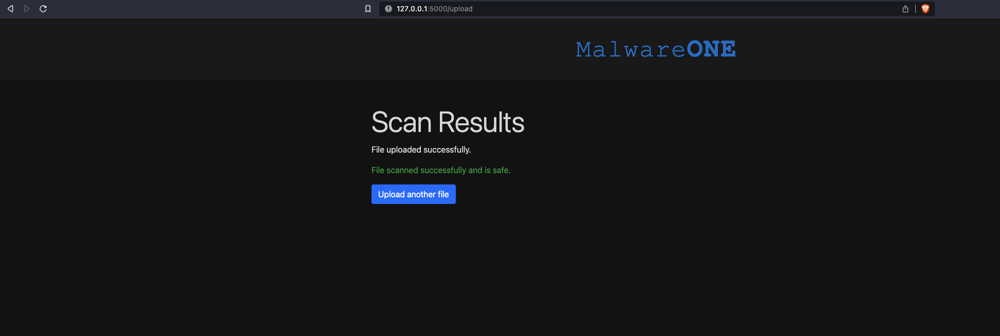

# Dockerized Flask Malware Scanner Demo

This is a simple Flask web application that demonstrates how to scan uploaded files for malware using Trend Micro's Anti-malware as a Service (AMaaS). It allows you to upload files for scanning, and if malware is detected, it will display the scan results.

## Prerequisites

Before you begin, ensure you have met the following requirements:

- **Docker**: You must have Docker installed on your system. If not, you can download it [here](https://docs.docker.com/get-docker/).
- **Cloud One account**: This demo app required a Cloud One account and a valid Cloud One API key in the "us-1" region. Free Cloud One trail available here: (https://cloudone.trendmicro.com/m)

## Getting Started

### 1. Clone the Repository

```bash
git clone https://github.com/jmlake569/AMaaS_demo_app.git
cd AMaaS_demo_app
```

### 2. Edit the DOCKERFILE by adding your Cloud One API key

```bash
ENV C1_API_KEY="YOUR C1 API KEY HERE"
```

### 2. Build the container

```bash
docker build -t flask-malware-scanner .
```

### 3. Run the contianer

```bash
docker run -p 5000:5000 flask-malware-scanner
```

### 4. Access the application

Open your web browser and navigate to http://localhost:5000 to access the application.

FYI: The login page is not recording user data please just select "Continue as guest". Authentication and storing data will be available in the next version of this application.


### 5. Upload a file

This is an example of a non-malicious file being uploaded: 



This is an example of a malicious file being uploaded: 

